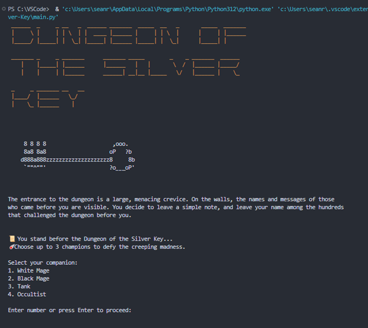
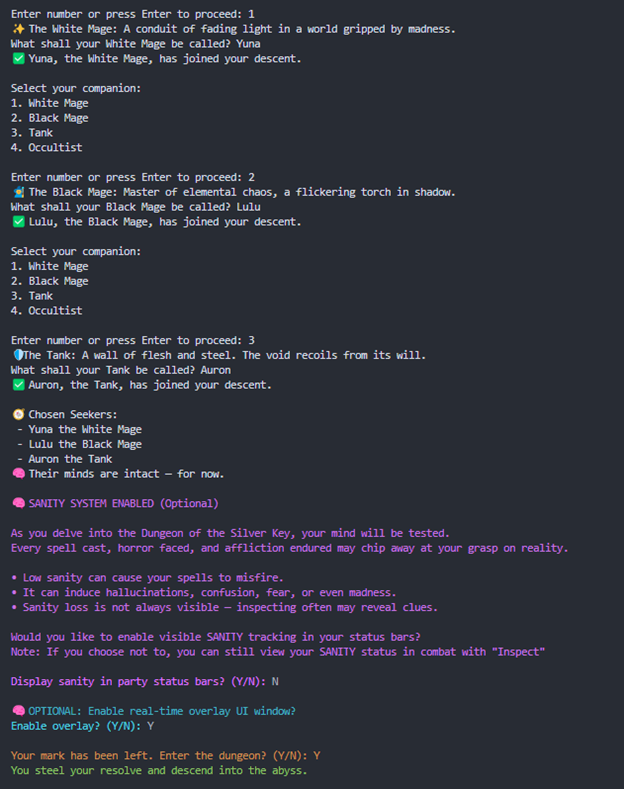
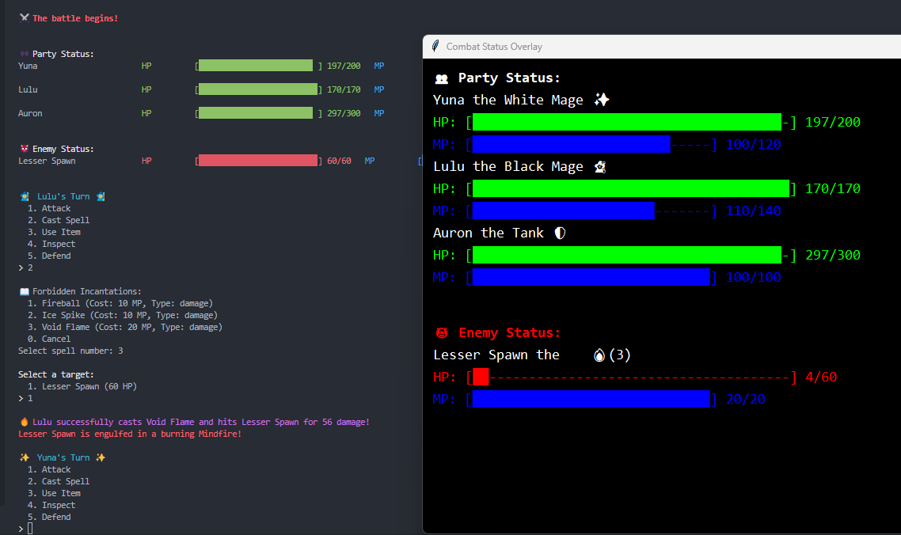
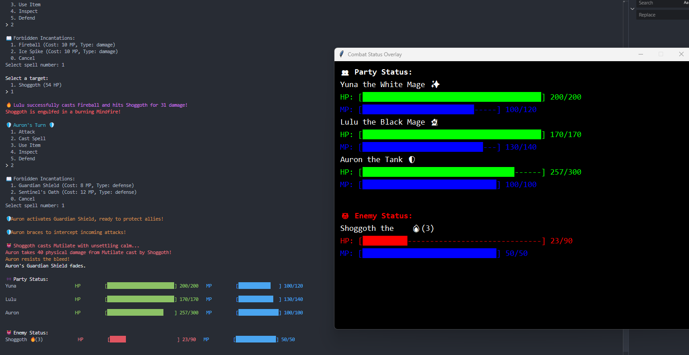
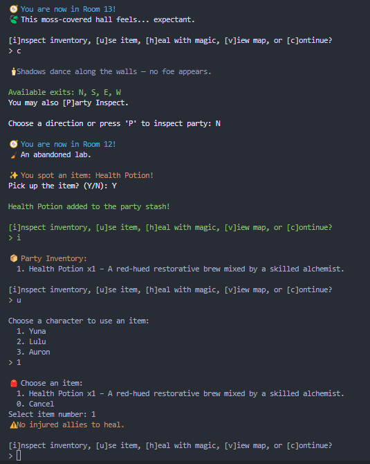
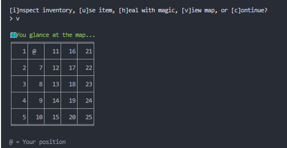
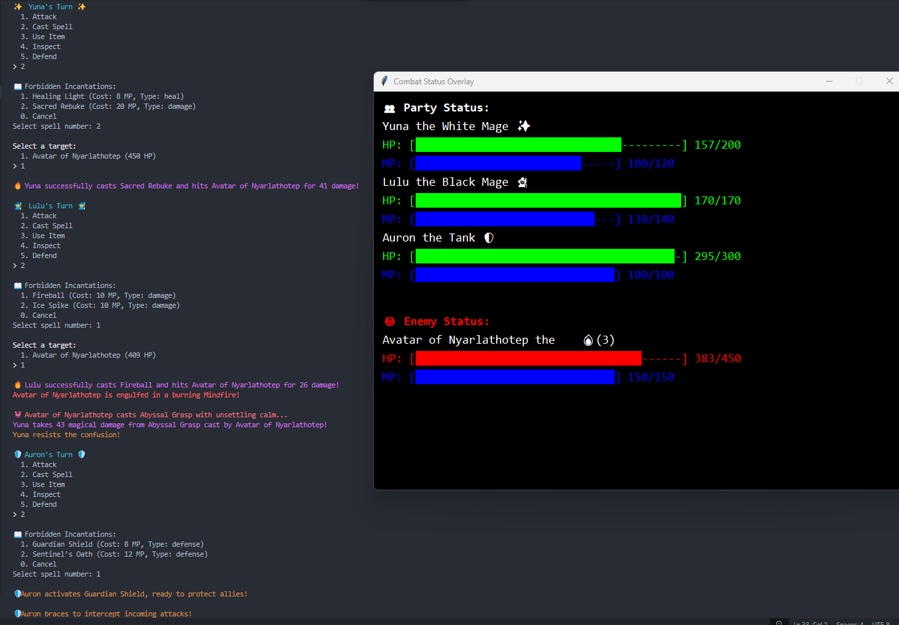

# 🗝️ Dungeon of the Silver Key

*A Lovecraftian Text-Based Dungeon Crawler Expanded from the Original by Mili-NT*

---

## 📖 Overview

Dungeon of the Silver Key is a Python-based, narrative-rich dungeon crawler built on top of the original project by [Mili-NT](https://github.com/Mili-NT/Dungeon-Of-The-Silver-Key). This updated fork greatly expands the core gameplay with:

- 🎭 **Multiple Playable Classes** (Tank, Black Mage, White Mage, Occultist)  
- ✨ **Turn-Based Spellcasting & Combat**  
- 🧠 **Madness, Fear, Confusion, and Sanity Systems**  
- 📚 **Spell-Taught Items & Dynamic Loot**  
- 📍 **Room-Based Dungeon Traversal**  
- 👹 **Unique Boss & Lovecraftian Enemies**  
- 🔄 **Replayability & Random Encounters**

---

## 🧩 Game Features

### 🎲 Tactical Party System
Choose your adventuring party with a full setup screen. Mix class roles for survivability and damage:
- **Tank** — Can protect allies, intercept hits, and endure madness  
- **White Mage** — Heals, restores sanity, and wards against mental afflictions  
- **Black Mage** — Hurls destructive spells like *Void Bolt* and *Fireball*  
- **Occultist** — Masters chaotic forces like *Eldritch Flame* and *Call of Madness*
- Use healing spells outside of battle through a dedicated menu
- Restore HP/MP between rooms to stay alive in long runs

### ⚔️ Turn-Based Combat Engine
Custom-designed combat logic includes:
- Speed-based initiative  
- Defensive Tank spells like **Guardian Shield** that fully intercept damage aimed at allies
- Lore-friendly spell effects (e.g., *Sentinel’s Oath*, *Arcane Cataclysm*)  
- Enemy-specific lore descriptions and attack flavor
- Bleed-inducing enemy abilities like *Claw*, *Mutilate*, and *Bite*

### 🧠 Mental Afflictions
Madness isn't just flavor — it affects gameplay:
- Status effects: *Confusion*, *Fear*, *Madness*, *Mindfire*  
- Sanity can be drained, restored, or traded for power  
- Effects persist across rooms unless healed or expired  
- Enemies can inflict effects based on spell-specific chances  
- *Bleed* causes HP loss each turn and can kill outside combat  
- Items like Ancient Scrolls or Cursed Tomes teach powerful or forbidden spells to specific classes, sometimes granting stat boosts as well.

### 🧭 Room-Based Exploration
- Navigate a 5x5 dungeon grid with North/South/East/West exits  
- Room descriptions evolve based on progress  
- Triggers item pickups, lore events, and random monster battles  
- Boss portal unlocks if you possess the **Silver Key**
- Status effects like *bleed* and *mindfire* persist between rooms, creating a strategic resource challenge

### 🔄 Refactor Comparison

The original project was a single 4,000+ line file. This fork introduces:

- ✅ 10+ modular Python files  
- ✅ Full class-based battle system  
- ✅ Mental status effects system  
- ✅ Room-based navigation with state tracking  
- ✅ Turn-based initiative and spellcasting  

This refactor improves maintainability, readability, and future extensibility.


---

## 📦 Project Structure

```plaintext
Dungeon-Of-The-Silver-Key/
├── .gitignore                    # Git exclusion rules
├── LICENSE                       # Project license
├── README.md                     # Project overview and documentation
├── main.py                       # Game entry point
│
├── dungeon_traverse.py          # Dungeon navigation logic
├── vivid_battle.py              # Turn-based battle system
├── status_effects.py            # Mental and physical affliction system
├── spells.py                    # Central spell registry and descriptions
├── items.py                     # Item definitions and effects
├── enemies.py                   # Enemy definitions and behavior
├── party_setup.py               # Player party creation and stats
├── rooms.py                     # Room descriptions and layout
├── random_encounter.py          # Random combat encounter handler
├── overlay_ui.py                # Optional: Real-time combat overlay (Tkinter)
├── ui_utils.py                  # Utility functions for UI and formatting
```

## 📸 Screenshots & Demo

### 🧵 Start Screen  


### 🛡️ Party Selection  


### 🔥 Spellcasting in Battle  


### 🧠 Mental Afflictions in Action  


### 🧭 Dungeon Room Traversal  


### 🗺️ Map View  


### 👤 Character Inspection  


### 👹 Final Boss Showdown  


---

## ✍️ Credits

- Original project by: [Mili-NT](https://github.com/Mili-NT/Dungeon-Of-The-Silver-Key)  
- Extended fork by: **Sean Randall**  
- Tools used: Python 3.11, Git, `colorama`, `pyfiglet`, terminal I/O


---

## 🎯 Purpose

This project was created for a **Foundations of Software Engineering** course and extended far beyond its original scope. It demonstrates:

- Modular Python design with maintainable architecture
- Applied open-source development workflows
- Balanced game mechanics integrated with storytelling
- Integration of complex systems like status effects, class synergy, and map-based exploration

## 🧪 Developer Notes

This project includes additional logic improvements, bug fixes, and extensibility support such as:
- Status effects decrementing on dungeon traversal
- Fix to prevent double battle triggers post-victory
- Modular spell handler for both in- and out-of-combat healing
- Enemy spell logic matches player spell system for maintainability

## ✅ Summary of Contributions

- Refactored original monolithic file into modular OOP design  
- Implemented full turn-based battle system with spellcasting  
- Added 15+ new spells and status effects  
- Introduced Guardian mechanics and bleeding system  
- Wrote out-of-combat healing logic  
- Debugged HP drain, fixed random battle loops, and balanced mechanics  
- Created this README as complete project documentation  

## 🚀 Try It Yourself

git clone https://github.com/Sean-Randall/Dungeon-Of-The-Silver-Key.git
cd Dungeon-Of-The-Silver-Key
python main.py

🧠 “That is not dead which can eternal lie...”
And with strange aeons, even this humble terminal game may awaken.

📄 Licensed under the MIT License — see [LICENSE](LICENSE) for details.
